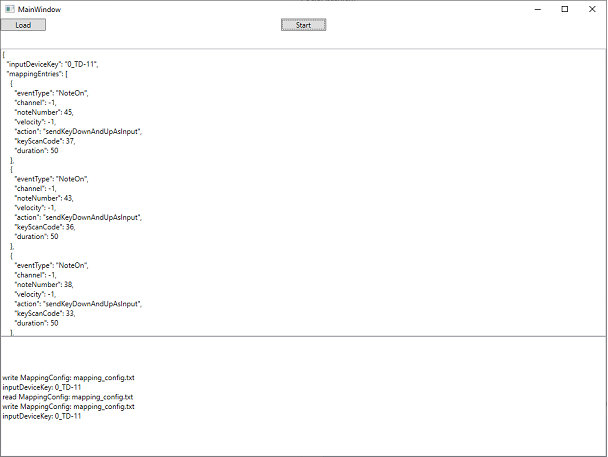

# Midi2Input
Midi-In => Simulated Input (SendInput, SendKey, ...)
<pre>
</pre>
How To Use
* see releases => unzip Release_xxxx_xx_xx.rar => run Midi2Input.exe => "press start"
* use logMidiEvents:true to see logs like
** eventType:NoteOff, channel:9, noteNumber:48, velocity:23
** eventType:NoteOn, channel:9, noteNumber:48, velocity:23
<pre>
</pre>
Example MappingConfig is for Roland TD-11 (Snare+Toms) => Keyboard "D","F","J","K" (Taiko no Tatsujin)
* create your own
<pre>
</pre>
ATM suported:
* DirectX.SendInput via user32.dll => allows to simulate keyboard events to games or other applications like dolphin (
<pre>
</pre>
Todo's:
* Support for sendKeys (not DirectX)
<pre>
</pre>
Keywords:
* dolphin, midi, controller, SendInput, edrums, rock, band, wii, keystrokes, keybd_event, SendKeys, PostMessage, user32, taiko
<pre>
</pre>
Alternatives (but not working for my needs)
* GlovePie, vJoy, MidiTranslator, Midikey2Key, Powershell-Scripts
<pre>
</pre>

